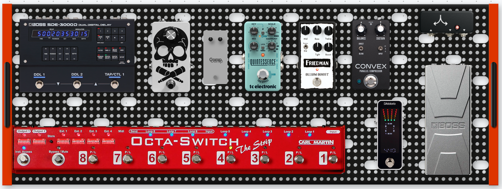

# 2026 Guitar Rig

## Description

This rig is based around an AMT Electronics SH-100-4R 4-channel 100 watt amplifier. It is wired using the four cable method and is set up in a wet/dry/wet configuration.

## Components

### Rack

- AMT Electronics SH-100-4R 4-channel 100 watt 1U head.

- Behringer Parametric EQ

- BBE Sonic Maximizer

### **Pedalboard**

- Temple Audio Duo 34 pedalboard

- Cioks power supply

- JHS Buffereed Splitter

- D'Addario pedal tuner

- Boss FV-30H (May swap out for George Dennis GD65 wah/volume)

- Carl Martin Octa-Switch “The Strip”

  - Loop switcher with relay amp control

- AionFX Convex compressor (Dinosaural OTC-201 clone)

- GUPTech Le Chiou (Friedman Buxom Boost clone)

- TC Electronic Quintessence harmonizer

- GUPTech SUN noise gate

  - Key in feed has an Amazon Basics compressor in line to increase sensitivity)

- Custom passive splitter with output transformer isolated.

- Boss SDE-3000D delay (Also provides chorus and flange)

- ISP Technologies Stealth Pro stereo guitar power amplifier

- Custom clone of the Mojotone Slammins 2x12” cab loaded with Celestion G12K-85 speakers.

- Two 1x12” rebuilt floor monitors loaded loaded with Celestion Seventy 80 speakers.

**Part 1: Main System Signal Flow**

**1. The Front-End Guitar Split (The Tracking Engine)**

- **Guitar** → **D'Addario Tuner Input**

- **D'Addario Tuner Output** → **Boss FV-30 Volume Pedal Input**

- **Boss FV-30 Volume Pedal Output** → **JHS Buffered Splitter Input**

- **JHS Splitter Output A (The Tracking Line):** Connects straight to the input of the **Amazon Basics Compressor**. The output of the compressor plugs straight into the Noise Gate's **Key / Input** jack *(Crucial: This heavily increases the gate's dynamic tracking sensitivity without compressing your actual audible tone).*

- **JHS Splitter Output B (The Main Tone Line):** Connects straight into Carl Martin Octa-Switch "The Strip" **Main Board Input** to drive your effects blocks.

**2. The Front-of-Amp Drive Section (Loops 1–3)**

- **Loop 1:** Aion FX Convex *(Dinosaural OTC-201 clone (Parallel Opto-Compressor))*.

- **Loop 2:** GUPTech Le Chiou *(Friedman Buxom Boost clone)*.

- **Loop 3:** *Empty / Open Spare.*

**3. The Switchable AMT Preamp (Loop 4)**

- **Loop 4 Send** → **AMT Stonehead SH-100-4R Main Front Input**

- **AMT Head FX Loop 1 Send** → **Behringer Parametric EQ** → **The Strip's Loop 4 Return**

- *Preset Logic: Turn Loop 4 ON for all presets.*

**4. The TC Electronic Quintessence Harmony Loop (Loop 5)**

- **Loop 5 Send** → **TC Electronic Quintessence Input** *(Mono)*

- **TC Electronic Quintessence Output** → **The Strip's Loop 5 Return** *(Mono)*

- *Preset Logic: Loop 5 ON for dual-guitar solo presets. Loop 5 OFF for regular rhythm and lead parts.*

**5. The Switchable Noise Gate Clamping Loop (Loop 6)**

- **Loop 6 Send** → Noise Gate **Gate Input** jack

- **Noise Gate Output** jack → **Loop 6 Return**

- *Preset Logic: Loop 6 ON for high-gain channels. Loop 6 OFF for clean channels.*

**6. The Master W/D/W Split & Isolation Box (Loop 7)**

Custom DIY box splits and isolates the signal natively inside its enclosure:

- **The Strip's Loop 7 Send** → Connected to **DIY Box Input**.

- **DIY Box Direct Out** → Connects via a short patch cable straight back into **The Strip's Loop 7 Return**.

- **DIY Box Isolated Out** → Connects via 8-channel snake to **AMT Head FX Loop Return**.

- *Preset Logic: Loop 7 must remain permanently ON for every preset.*

**7. The Wet Stereo Delay Section (Loop 8)**

- **Loop 8 Send:** → **Boss SDE-3000D Input L/Mono**.

- **Boss SDE-3000D Outputs (L & R):** **Dual-TS-to-TRS Insert Cable** → **The Strip's Loop 8 Return**.

- **The Strip's Master Outputs 1 & 2** → Connect directly down snake to **ISP Technologies Stealth Pro Inputs 1 & 2** → **Left and Right Custom 1x12 Monitor Wedges**

- **AMT Preamp Out** → **BBE Sonic Maximizer Input** → **AMT Power Amp In**.

**Part 2: 6-Channel Snake Connection Matrix**

|                   |                                                       |                                                   |                               |                                                                        |
|-------------------|-------------------------------------------------------|---------------------------------------------------|-------------------------------|------------------------------------------------------------------------|
| **SNAKE CHANNEL** | **OUTGOING SIGNAL FROM (PEDALBOARD)**                 | **INCOMING DESTINATION TO (RACK BAG)**            | **PHYSICAL CABLE TRACK TYPE** | **UTILITY**                                                            |
| **Channel 1**     | **Loop 4 Send**                                       | **AMT Stonehead Main Front Input**                | Mono TS (Shielded Instrument) | Clean Guitar to Amp Input                                              |
| **Channel 2**     | **AMT Head FX Loop 1 Send** *(From Rack)*             | **The Strip's Loop 4 Return**                     | Mono TS (Shielded Instrument) | Preamp Tone Back to Board                                              |
| **Channel 3**     | **DIY Box Isolated Out**                              | **AMT Head FX Loop 1 Return**                     | Mono TS (Shielded Instrument) | Gated/Harmonized Tone to Dry Amp                                       |
| **Channel 4**     | **The Strip's Master Outputs 1 & 2** *(Via Breakout)* | **ISP Stealth Pro Inputs 1 & 2** *(Via Breakout)* | **True TRS Line**             | Consolidated Stereo Delay Feed                                         |
| **Channel 5**     | **The Strip's EXT SWITCH 1 & 2** *(Via Breakout)*     | **AMT Amp Channel Switching Jack**                | **True TRS Line**             | Relay 1 (Tip) & 2 (Ring): Preamp Channels                              |
| **Channel 6**     | **The Strip's EXT SWITCH 3 & 4** *(Via Breakout)*     | **AMT Amp Master Volume / Loop Jack**             | **True TRS Line**             | Relay 3 (Tip): **Master Volume 2** / Relay 4 (Ring): Forced Lock State |
| **Channels 7-8**  | *Open Spares*                                         | *Unplugged / Clean Layout Lines*                  | *Open TRS Tracks*             | **Emergency Stage Backups**                                            |

**Part 4: Temple Audio MOD Panel Layout Blueprint**

|                   |              |                                                   |                                       |                                                  |
|-------------------|--------------|---------------------------------------------------|---------------------------------------|--------------------------------------------------|
| **SIDE MOD UNIT** | **MOD JACK** | **INTERNAL PEDALBOARD CONNECTION**                | **EXTERNAL SNAKE LINE (TO RACK BAG)** | **FUNCTION**                                     |
| **4X MOD**        | **Jack A**   | The Strip's Loop 4 Send                           | **Snake Channel 1**                   | Clean Guitar to AMT Input                        |
|                   | **Jack B**   | The Strip's Loop 4 Return                         | **Snake Channel 2**                   | Preamp Tone Back to Board                        |
|                   | **Jack C**   | DIY Box Isolated Out                              | **Snake Channel 3**                   | Gated/Harmonized Tone to Dry Amp                 |
|                   | **Jack D**   | The Strip's Master Outputs 1 & 2 *(Via Breakout)* | **Snake Channel 4**                   | Stereo Delay Feed *(TRS Line)*                   |
|                   |              |                                                   |                                       |                                                  |
| **2X MOD**        | **Jack 1**   | The Strip's EXT SWITCH 1 & 2 *(Via Breakout)*     | **Snake Channel 5**                   | Relay Control: Channels *(TRS Line)*             |
|                   | **Jack 2**   | The Strip's EXT SWITCH 3 & 4 *(Via Breakout)*     | **Snake Channel 6**                   | Relay Control: Volume & Forced Loop *(TRS Line)* |
